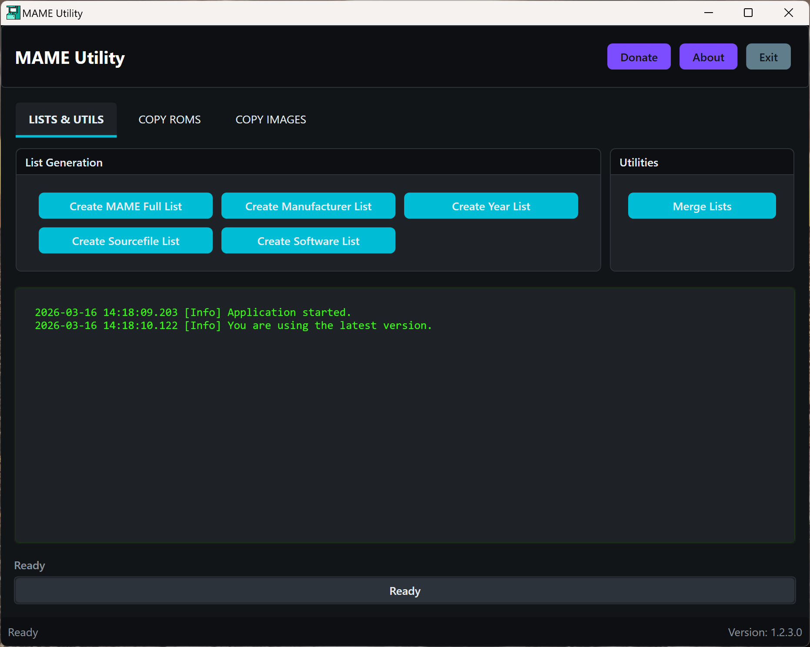
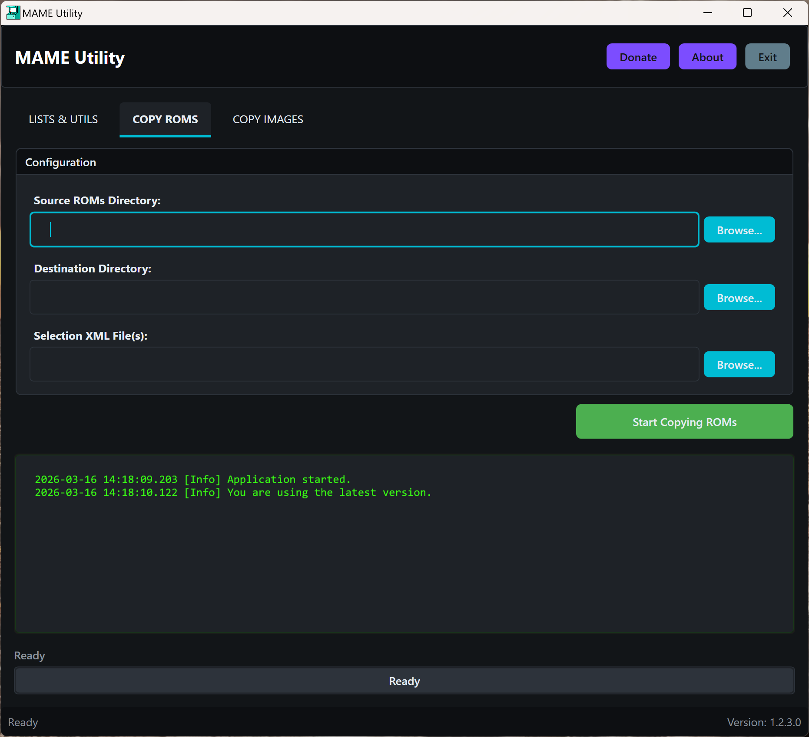

# MAME Utility

The MAME Utility is a comprehensive Windows desktop application designed to manage the full driver information of the MAME (Multiple Arcade Machine Emulator) in XML format, which is available on the [MAME](https://www.mamedev.org/release.html) website. It can generate multiple simplified (and smaller) XML subsets and can also copy ROMs and image files based on the generated XML.  
The tool is built using C#, the WPF (Windows Presentation Foundation) framework, and the .NET Core framework.

## Features

- **MAME List Generation**: Users can create simplified lists of MAME games, including full lists, manufacturer-specific lists, year-specific lists, and source file-specific lists.
- **List Merging**: Combines multiple XML lists into a single, consolidated list. This is particularly useful for users who maintain separate lists for different categories or purposes and wish to unify them.
- **ROM Management**: Allows copying of ROMs from a source directory to a destination directory based on game information contained in specified XML files. This feature simplifies the process of organizing and managing MAME ROM collections.
- **Image Management**: Similar to ROM management, this feature facilitates copying of game images (e.g., screenshots, marquee images) from a source directory to a destination directory, guided by game information in XML files.
- **Progress Tracking**: The application includes a progress bar that provides visual feedback during long-running operations, helping users stay informed about the process.

## Getting Started

### Prerequisites

- Windows 7 or later.
- .NET Core runtime installed.
- MAME ROMs and images you wish to manage.
- The MAME full driver information in XML format (available from the official [MAME](https://www.mamedev.org/release.html) website).

## Usage

Upon launching the MAME Utility, users are greeted by a straightforward interface divided into sections for each of its core functionalities:

1. **Generate Lists**: Create a full list, manufacturer list, year list, or source file list of MAME games.
2. **Merge Lists**: Select multiple XML files to merge into a single file.
3. **Copy ROMs/Images**: Choose the source and destination directories, along with the XML files containing ROM or image information, to copy the corresponding files.

## Screenshots

## Support

If you like the software, please give us a star. 
Consider [donating](https://www.purelogiccode.com/donate) to support the project or simply to express your gratitude!

## License

Distributed under the GPL-3.0 License. See `LICENSE` for more information.

## Acknowledgments

This tool would not be possible without the extensive documentation and resources provided by the MAME project. Special thanks go to the MAME developers for their dedication to preserving the history of arcade games.

## Developer

- **Peterson Fernandes** – [Github Profile](https://github.com/drpetersonfernandes)