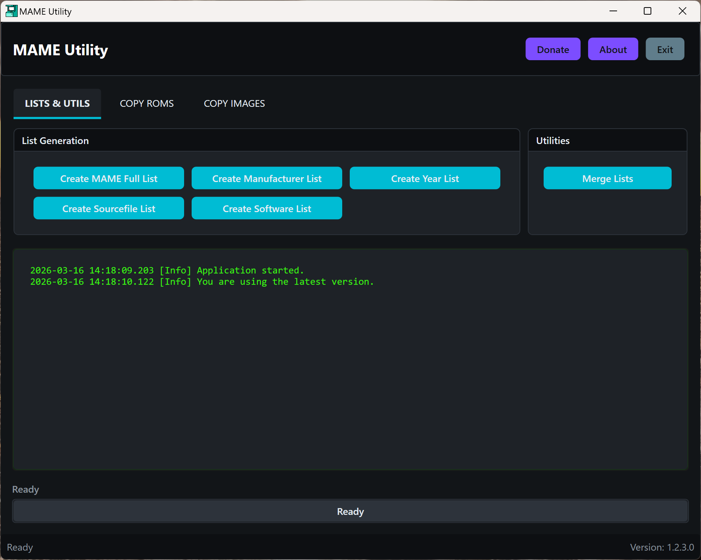
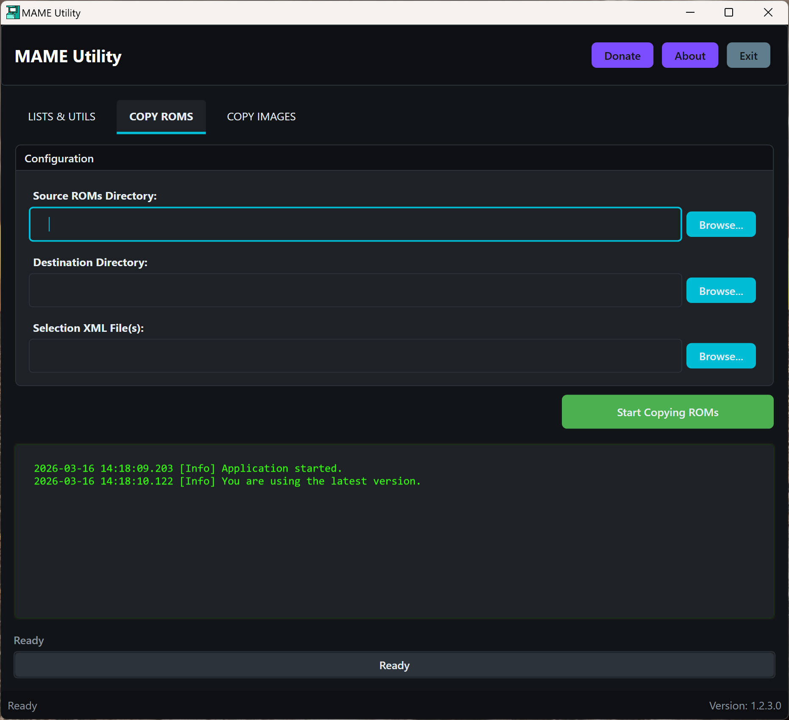
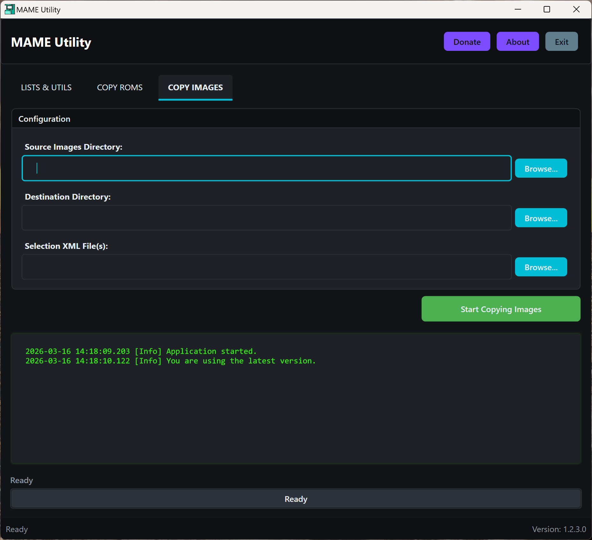

# MAME Utility

## Overview

MAME Utility is a high-performance Windows tool designed to manage, organize, and filter MAME (Multiple Arcade Machine Emulator) data. It allows users to generate specialized XML lists, merge databases into optimized formats, and manage ROM/image collections with ease.

## Features

-   **High-Performance List Generation**: Generate filtered XML lists based on:
    -   **Full Driver Info**: Simplified name/description mapping.
    -   **Manufacturer**: Separate files for every manufacturer (e.g., Capcom.xml, Nintendo.xml).
    -   **Year**: Organized by release year.
    -   **Source File**: Organized by MAME driver source code.
    -   **Software List**: Consolidated XMLs from MAME software list directories.
-   **Parallel Processing**: Utilizes multi-core processing for heavy XML parsing and file operations, significantly reducing wait times.
-   **Smart Merging**: Combine multiple XML lists (both Machine and Software formats) into a single XML.
-   **SimpleLauncher Compatibility**: Automatically generates a `.dat` file in **MessagePack** format during merging, fully compatible with SimpleLauncher's MameConfig.
-   **Collection Management**:
    -   **Copy ROMs**: Batch copy ZIP files based on filtered XML lists.
    -   **Copy Images**: Supports PNG, JPG, and JPEG synchronization based on XML entries.
-   **Robust UI & Feedback**:
    -   Real-time progress tracking with percentage and elapsed time.
    -   **Cancellation Support**: Safely stop long-running operations at any time.
    -   Integrated Log Window for detailed operation history and error debugging.
-   **Automated Bug Reporting**: Optional integration to report critical exceptions to improve software stability.

## Usage

1.  **Create Lists**:
    -   Select a list type (e.g., "Create MAME Year List").
    -   Provide the official MAME `listxml` output (usually a large XML file).
    -   The utility will parse and split the data into your chosen directory.
2.  **Merge Lists**:
    -   Click "Merge Lists" and select multiple XML files.
    -   The app will remove duplicates and generate both a merged `.xml` and a binary `.dat` (MessagePack).
3.  **Copy ROMs/Images**:
    -   Select your source collection and a destination folder.
    -   Provide the XML list(s) that define which games you want to "pick" from your full set.

## Prerequisites

-   **Operating System**: Windows 10 or later (Windows 7/8 supported with appropriate runtimes).
-   **Runtime**: [.NET 10.0 Desktop Runtime](https://dotnet.microsoft.com/download/dotnet/10.0).
-   **Data**: MAME ROMs, images, and the MAME full driver information in XML format (generated via `mame -listxml > mame.xml`).

## Technical Details

-   **Framework**: .NET 10 (WPF)
-   **Serialization**: [MessagePack for C#](https://github.com/neuecc/MessagePack-CSharp) for high-speed binary data handling.
-   **Architecture**: Service-based architecture with a centralized Service Locator for logging, dialogs, and processing.
-   **IO**: Asynchronous streaming XML readers/writers to handle multi-gigabyte files without memory exhaustion.

## License

This project is licensed under the terms of the [GNU General Public License v3.0](LICENSE.txt).

## Support

If you find this utility helpful, please give the repository a ⭐.  
Consider [donating](https://www.purelogiccode.com/donate) to support further development!

## Developer

- **Peterson Fernandes** – [Github Profile](https://github.com/drpetersonfernandes) – [PureLogicCode](https://www.purelogiccode.com)