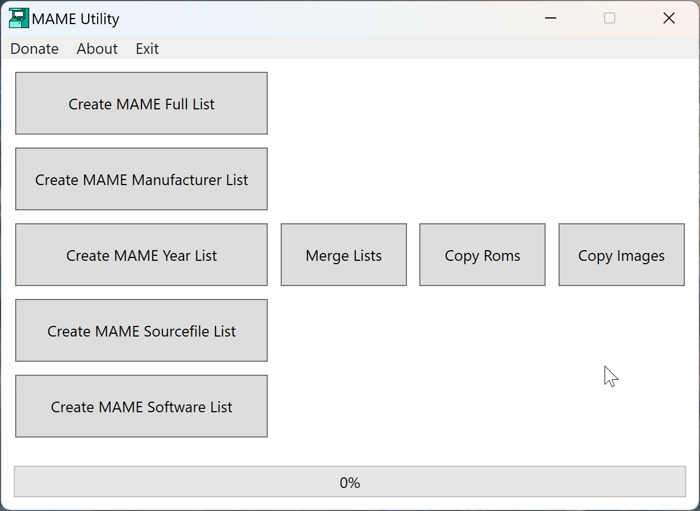

# MAME Utility

The MAME Utility is a comprehensive Windows desktop application designed to manage the MAME (Multiple Arcade Machine Emulator) full driver information in XML format, that is available on the [MAME](https://www.mamedev.org/release.html) website. It can generate multiple simplified (and smaller) XML subsets and also copy ROMs and image files based on the created XML. 
The tool is built using C#, WPF (Windows Presentation Foundation) framework and .Net Core framework.

## Features

- **MAME List Generation**: Users can create simplified lists of MAME games, including full lists, manufacturer-specific lists, year-specific lists, and source file-specific lists.

- **List Merging**: Combines multiple XML lists into a single, consolidated list. This is particularly useful for users who maintain separate lists for different categories or purposes and wish to unify them.

- **ROM Management**: Allows for the copying of ROMs from a source directory to a destination directory based on the game information contained within specified XML files. This feature simplifies the process of organizing and managing MAME ROM collections.

- **Image Management**: Similar to ROM management, this feature facilitates the copying of game images (e.g., screenshots, marquee images) from a source directory to a destination directory, guided by game information in XML files.

- **Progress Tracking**: The application includes a progress bar to provide visual feedback during long-running operations, enhancing the user experience by keeping users informed about the process.

## Getting Started

### Prerequisites

- Windows OS 7 or latter.
- .NET Core runtime installed.
- MAME ROMs and images you wish to manage.
- MAME full driver information in XML format (can be obtained from the official [MAME](https://www.mamedev.org/release.html) website).

## Usage

Upon launching the MAME Utility Tool, users are greeted with a straightforward interface divided into sections for each of its core functionalities:

1. **Generate Lists**: Choose from creating a full list, manufacturer list, year list, or source file list of MAME games.
2. **Merge Lists**: Select multiple XML files to merge into a single file.
3. **Copy ROMs/Images**: Select the source and destination directories, and the XML files containing ROM/image information, to copy ROMs/images accordingly.

## Screenshots

## Support

If you like this project and want to support the development of this and other similar projects, consider donating through [Buy Me a Coffee](https://www.buymeacoffee.com/purelogiccode).

## License

Distributed under the GPL-3.0 License. See `LICENSE` for more information.

## Acknowledgments

This tool would not be possible without the extensive documentation and resources provided by the MAME project. Special thanks to the MAME developers for their hard work and dedication to preserving the history of arcade games.

## Developer

- **Peterson Fernandes** - [Github Profile](https://github.com/drpetersonfernandes)

